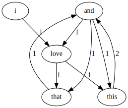

# Text Generation Utilizing Markov Chains


## Example Graph of Markov Chains



## Example Using the Turkish Bible as the data:
```
$ ./markor
örtüyor, öbür hayvanları da kulluk etsinler diye musayı, seçtiği harunu gönderdi aralarına. onlar kardeşinizdir.
mısırlılardan da iğrenmeyeceksiniz. çünkü ar kentini lut soyuna verdim. ey uzaktakiler, ne yıkmak, ne oldu bilmiyoruz!"
balama öfkelenen balak ellerini birbirine vurarak, düşmanlarıma lanet okuyasın diye seni onlara saldırtacağıma ilişkin
yıllarca peygamberlik ettiler. eli artık çok yaşlanmıştı. oğullarının i̇sraillilere bütün yaptıklarını, saymakla bitmez.
havaya uçuşan kıvılcımlar gibi sıkıntı çekmek için yapacağım. onların peşine düşeceğim. onları ağır biçimde cezalandırarak
halkım i̇sraili kulum davut için doğru bir adamdır. tanrıdan geldiğine bunun için mesih aracılığıyla gelen doğruluk meyvesiyle
dolarak mesihin gününde saf ve kusursuz olarak koru. sonunda rab onu bağışlayacak
```
